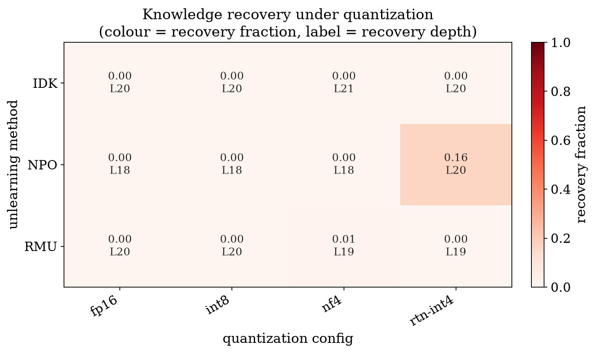

# LeakLens

**Auditing whether unlearning survives deployment-time quantization, and localizing where it leaks.**

> Unlearning is validated at FP16. Models are deployed at 4-bit. LeakLens measures the gap, and shows
> you which layer it opens at.

Machine unlearning claims to surgically delete a specific piece of a model's knowledge. Quantization
then applies a second, much cruder compression before deployment. Following the view of LLM training as
lossy compression \[Conklin et al., *Learning is Forgetting*, arXiv:2604.07569\], LeakLens asks whether
the second compression undoes the first deletion, and uses the **logit lens** to localize exactly where
in the network the supposedly-forgotten information comes back. It builds directly on the mechanistic
unlearning-evaluation methods from the author's TUM master's thesis.

## What it does

Given a base model that knows a set of facts, one or more *unlearned* models that forgot them at FP16,
and a list of deployment quantization configs, LeakLens reports, per (method $\times$ quant):

* **behavioral recovery** — how much of the deleted knowledge returns (gold probability, recall, ROUGE);
* **recovery fraction** — that return normalized against the FP16-unlearned baseline and the base;
* **recovery depth** — the *shallowest layer* at which the quantized model's gold-token rank returns to
  within a threshold of the base model's (the headline representational metric);

and renders it all as a single heatmap (rows = method, columns = quant, colour = recovery, label =
depth) plus a recovery-trajectory figure and a text report card.

## First result (Hubble-8B)



Auditing three unlearning methods against four quantization configs on the Hubble-8B suite (the base
recalls the birthdates at gold-probability **0.909**) surfaces exactly one hot cell:
**NPO's unlearning is undone by crude 4-bit round-to-nearest quantization.** The forgotten fact returns
from median rank **4,263** to **rank 3** (recall $0 \to 0.24$, recovery fraction **0.16**), while the
calibration-aware bitsandbytes INT8 and NF4 keep it buried. IDK stays output-suppressed but is internally
intact throughout (it redirects rather than erases); RMU is deep-suppressed and only mildly affected. The
takeaway: the quantization **backend**, not just the bit-width, decides whether unlearning survives
deployment. (Config: `configs/tier1_8b.yaml`.)

### Calibration-set attack (preliminary, inconclusive)

Sweeping the AWQ calibration corpus from generic text through forget-adjacent to the forget set itself
(`configs/attack_calib_8b.yaml`) shows only a **weak, directional** effect on behavioral recovery: the
generic calibration (farthest from the forget domain) recovers least (0.006) and forget/adjacent slightly
more (0.008 / 0.009), but the gaps are within noise at $n=25$ and not cleanly monotonic. So on this
evidence calibration-set choice is **not** shown to be a genuine attack surface. What *is* strong is that
4-bit AWQ re-opens NPO's forgotten fact **representationally** regardless of calibration: the median
internal rank drops from **4,263** (fp16) to **~30**, even while output probability stays low. The decisive
next test is a real GPTQ backend (error-compensated, more calibration-sensitive than this
activation-scaling AWQ) at full $n$. Reported as a null rather than spun.

## Quickstart

```bash
pip install -e .                                   # installs the `leaklens` CLI
leaklens audit --config configs/tier0_smoke.yaml --dry-run   # validate the plan (no GPU needed)
leaklens audit --config configs/tier0_smoke.yaml             # run (needs a GPU)
# on a Slurm cluster:
sbatch scripts/run_audit.sbatch configs/tier0_smoke.yaml
```

Outputs land in `output_dir` (default `runs/tier0`): `summary.csv`, `heatmap.png`, `trajectory.png`,
`report_card.txt`.

## The recovery-depth metric

For a fact, the logit lens gives a per-layer rank of the gold token. Let $r^{\text{base}}_L$ and
$r^{\text{quant}}_L$ be the base and unlearned-then-quantized ranks at layer $L$. The recovery depth is
the shallowest layer in the top half of the stack with
$|\log r^{\text{quant}}_L - \log r^{\text{base}}_L| \le \tau \cdot \log r^{\text{base}}_L$
(default $\tau = 0.25$). It answers not just *whether* forgotten knowledge returns under quantization but
*where in the computation* it re-enters. See `decision.md` (D5).

## Quantization backends

Implemented with no extra native dependency: `none` (FP16 reference), `bnb` (bitsandbytes INT8 / NF4 /
FP4, the QLoRA path), and `rtn` (transparent round-to-nearest fake-quant, INT8/INT4). `gptq`, `awq`, and
`gguf` are explicit extension points (they raise a clear error until implemented), because they need
calibration or native kernels; the pipeline already treats the backend as pluggable. See `decision.md`
(D4).

## Layout

```
leaklens/            the package (config, data, quantize, models, lens, metrics, audit, report, cli)
configs/             audit configs (one YAML fully describes a run)
scripts/             Slurm submission
tests/               CPU-only smoke tests
decision.md          why each meaningful choice was made
flow.md              how execution travels through the code
leaklens-project-spec.md   the original portfolio spec
```

## Status / scope

This is the Tier-0/Tier-1 core: real audits over `bnb` and `rtn` backends with the logit-lens
recovery-depth metric. Extension points (documented in the spec): GPTQ/AWQ/GGUF backends, the tuned
lens, the calibration-set-as-attack-surface experiment, and the PII/YAGO attribute breakdown.
